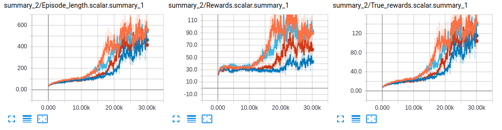
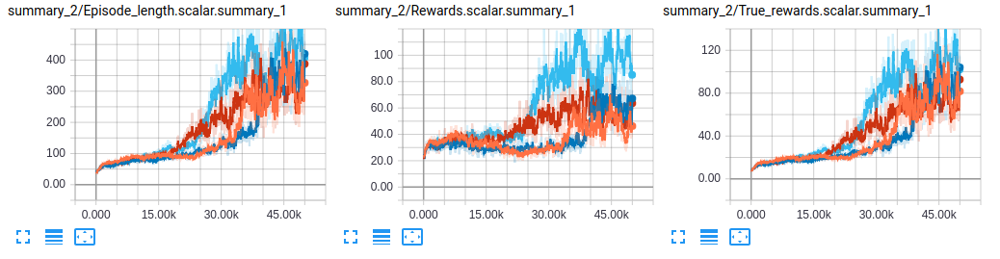

# Merel-MoCap-GAIL

An implementation of Merel et al.'s paper on generative adversarial imitation learning (GAIL) using motion capture (MoCap) data:

**Learning human behaviors from motion capture by adversarial imitation**  
Josh Merel, Yuval Tassa, Dhruva TB, Sriram Srinivasan, Jay Lemmon, Ziyu Wang, Greg Wayne, Nicolas Heess  
[arXiv preprint arXiv:1707.02201, 2017](https://arxiv.org/abs/1707.02201)  

### Acknowledgements

This code is based on an earlier version developed by [Ruben Villegas](https://github.com/rubenvillegas).

### Clone the Repository

This repo contains one submodule (`baselines`), so make sure you clone with `--recursive`:

  ```Shell
  git clone --recursive https://github.com/ywchao/merel-mocap-gail.git
  ```

## Installation

Make sure the following are installed.

- [Our own branch of baselines](https://github.com/ywchao/baselines/tree/merel-mocap-gail) provided as a submodule
    1. Change the directory:

        ```Shell
        cd baselines
        ```

    2. Go through the installation steps in this [README](https://github.com/ywchao/baselines/tree/merel-mocap-gail) without re-cloning the repo.
- [An old verion of dm_control](https://github.com/deepmind/dm_control) provided as a submodule
    1. Change the directory:

        ```Shell
        cd dm_control
        ```

    2. Go through the installation steps in this [README](https://github.com/deepmind/dm_control/tree/c24ec9f5f3cb3c25c6571c89c9f60bf3350f5711) without re-cloning the repo. This requires the installation of [MuJoCo](http://www.mujoco.org/). Also make sure to install the cloned verion:

        ```Shell
        pip install .
        ```

    Note that we have only tested on this version. The code might work with newer versions but it is not guaranteed.
- [Matplotlib](https://matplotlib.org/)

## Training and Visualization

1. Download the [CMU MoCap dataset](http://mocap.cs.cmu.edu/):

    ```Shell
    ./scripts/download_cmu_mocap.sh
    ```

    This will populate the `data` folder with `cmu_mocap`.

2. Preprocess data. We use the walk sequences from subject 8 as described in the paper.

    ```Shell
    ./scripts/data_collect.sh
    ```

    The output will be saved in `data/cmu_mocap.npz`.

3. Visualize the processed MoCap sequences in dm_control:

    ```Shell
    ./scripts/data_visualize.sh
    ````

    The output will be saved in `data/cmu_mocap_vis`.

4. Start training:

    ```Shell
    ./scripts/train.sh 0 1
    ```

    Note that:
    - The first argument sets the random seed, and the second argument sets the number of used sequences.
    - For now we use only sequence 1. We will show using all sequences in later steps.
    - The command will run training with random seed 0. In practice we recommend running multiple training jobs with different seeds in parallel, as the training outcome is often sensitive to the seed value.

    The output will be saved in `output`.

5. Monitor training with TensorBoard:

    ```Shell
    tensorboard --logdir=output --port=6006
    ```

    Below are the curves of episode length, rewards, and true rewards, obtained with four different random seeds:

    

6. Visualize trained humanoid:

    ```Shell
    ./scripts/visualize.sh \
      output/trpo_gail.obs_only.transition_limitation_1.humanoid_CMU_run.g_step_3.d_step_1.policy_entcoeff_0.adversary_entcoeff_0.001.seed_0.num_timesteps_5.00e+07/checkpoints/model.ckpt-30000 \
      output/trpo_gail.obs_only.transition_limitation_1.humanoid_CMU_run.g_step_3.d_step_1.policy_entcoeff_0.adversary_entcoeff_0.001.seed_0.num_timesteps_5.00e+07/vis_model.ckpt-30000.mp4 \
      0 \
      1
    ```

    The arguments are the model path, output video (mp4) file path, random seed, and number of used sequences.

    Below is a sample visualization:

    

7. If you want to train with all sequences from subject 8. This can be done by replacing `1` by `-1` in step 4:

    ```Shell
    ./scripts/train.sh 0 -1
    ```

    Similarly, for visualization, replace `1` by `-1` and update the paths:

    ```Shell
    ./scripts/visualize.sh \
      output/trpo_gail.obs_only.transition_limitation_-1.humanoid_CMU_run.g_step_3.d_step_1.policy_entcoeff_0.adversary_entcoeff_0.001.seed_0.num_timesteps_5.00e+07/checkpoints/model.ckpt-50000 \
      output/trpo_gail.obs_only.transition_limitation_-1.humanoid_CMU_run.g_step_3.d_step_1.policy_entcoeff_0.adversary_entcoeff_0.001.seed_0.num_timesteps_5.00e+07/vis_model.ckpt-50000.mp4 \
      0 \
      -1
    ```

    Note that training takes longer to converge when using all sequences:

    

    A sample visualization:

    
